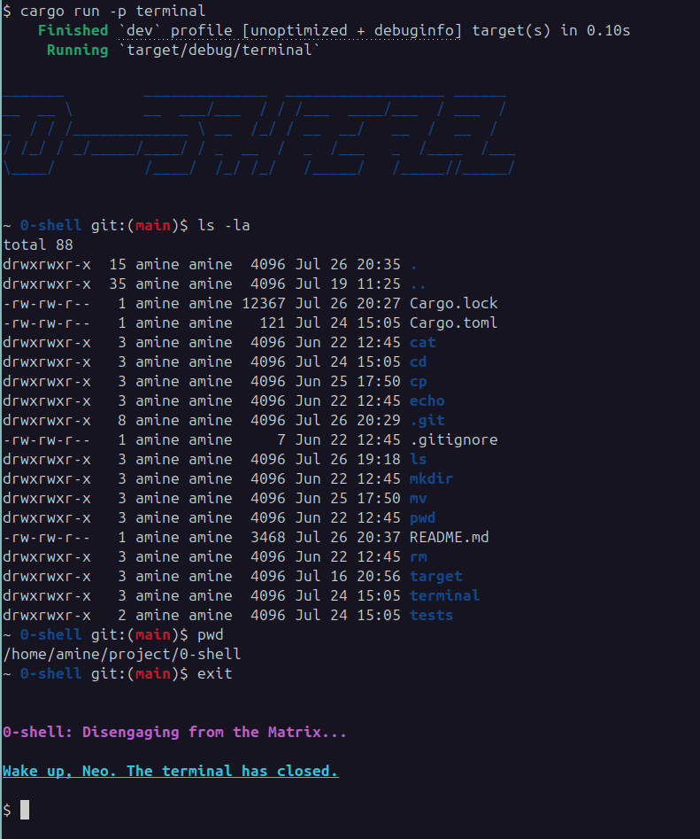

# 0-Shell
A minimalist Unix-like shell built in **Rust** — no `bash`, no `sh`, just pure system-level control.

---

## About This Project
**0-Shell** is a lightweight, standalone shell inspired by tools like **BusyBox**, built for embedded Linux environments. It uses **Rust** to implement core shell commands **from scratch**, without relying on external programs.


---

## What You'll Build
A fully working shell that:
- Displays an intelligent prompt: `$ [branch] ~/current/path`
- Features **colored output** similar to `zsh` with syntax highlighting
- Accepts and parses complex user input with **advanced input parsing**
- Executes built-in commands with proper argument handling
- Handles errors gracefully with informative messages
- Supports command chaining and redirection
- Exits on `exit` or `Ctrl+D`

---

## Shell Features

### **Smart Prompt & UI**
- **Dynamic prompt**: Shows current directory and Git branch when available
- **Colored output**: Syntax highlighting for commands, files, and directories
- **Zsh-like experience**: Modern shell aesthetics with intuitive color coding
- **Error highlighting**: Clear visual feedback for invalid commands


### **System Integration**
- **Git awareness**: Displays current branch in prompt
- **Path intelligence**: Smart directory navigation and display
- **Signal handling**: Proper `Ctrl+D` behavior

---

## What You'll Learn
- How to use Rust's standard and low-level system libraries
- How to write your own versions of Unix commands
- How to build a modular command-execution loop
- **Advanced terminal manipulation** and ANSI color codes
- **Input parsing algorithms** and command-line argument processing
- **Git integration** and repository status detection
- **Cross-platform terminal handling** in Rust

---

## Built-In Commands
| Command | Description                              | Features |
|---------|------------------------------------------|----------|
| `echo`  | Print text to stdout                     | Color support, escape sequences |
| `cd`    | Change the current working directory     | Smart path completion, `~` expansion |
| `ls`    | List directory contents (`-l`, `-a`, `-F`) | **Full color coding**, file type indicators |
| `pwd`   | Show the current working directory       | Git-aware path display |
| `cat`   | Display file contents                    | Syntax highlighting for code files |
| `cp`    | Copy files                               | Progress indication, recursive copy |
| `rm`    | Remove files or directories (`-r` flag)  | Safe deletion with confirmation |
| `mv`    | Move or rename files                     | Smart conflict resolution |
| `mkdir` | Create directories                       | Recursive creation with `-p` |
| `exit`  | Exit the shell                           | Graceful cleanup and goodbye message |

---


### Clone the Repository
```bash
git clone https://github.com/aminehabchi/0-shell
cd 0-shell
cargo run -p terminal
```


## Team Members & Responsibilities
| Name                  | Assigned Commands           | Additional Responsibilities |
|-----------------------|-----------------------------|----------------------------|
| **Ali Louhab**        | `cat`, `rm`, `exit`, `mkdir` | Error handling, file operations |
| **Amine Habchi**      | `mv`, `cp`, `pwd`, `ls`     | **Input parsing**, **prompt system**, colors |
| **Abdelouahab Bouchik** | `cd`, `echo` , `clear`     | Terminal control, Git integration |

---

